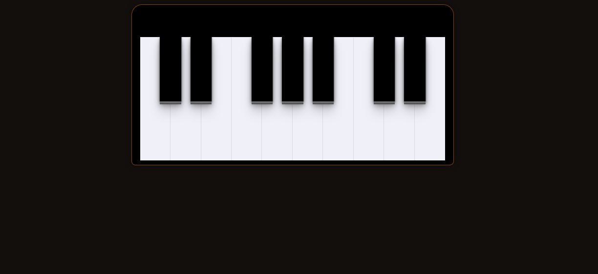

<h1 align="center">Piano feito com Javascript</h1>

 
        <a href="#-tecnologias">Tecnologias</a>&nbsp;&nbsp;&nbsp;&nbsp;&nbsp;&nbsp;
        <a href="#-projeto">Projeto</a>&nbsp;&nbsp;&nbsp;&nbsp;&nbsp;&nbsp;
        <a href="#-layout">Projeto</a>&nbsp;&nbsp;&nbsp;&nbsp;&nbsp;&nbsp;
        <a 

 

    

 

## 🚀 Tecnologias

Esse projeto foi desenvolvido com as seguintes tecnologias:

- HTML e CSS
- Javascript

## 💻 Projeto

O Piano é um projeto que simula um teclado de forma digital.

## 📩 Layout

Você pode visualizar o layout do projeto através [DESSE LINK](https://fabiohenriquefarias.github.io/Piano/).

## 📚 Referências

Referência do projeto.

[@Eliteware](https://codepen.io/Eliteware/pen/wDHIC)    
[@gabrielcarol_](https://codepen.io/gabrielcarol/pen/rGeEbY)
